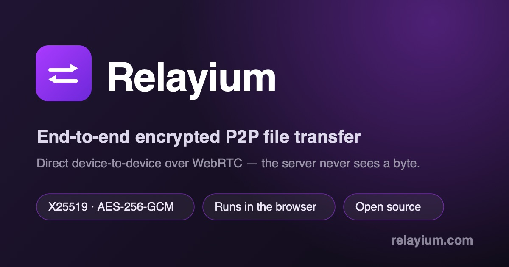

<p align="center">
  
</p>

<h1 align="center">Relayium</h1>

<p align="center">
  <strong>Open-source, end-to-end encrypted peer-to-peer file transfer — right in your browser.</strong><br>
  Files stream directly between devices over WebRTC and never touch the server.
</p>

<p align="center">
  <a href="https://relayium.com/"></a>
  <a href="LICENSE"></a>
  
  
</p>

---

## What is Relayium?

Relayium is a serious attempt at a **next-generation file transfer protocol**: press one button to send,
and the software picks the best path (LAN direct → P2P → relay) while keeping everything
**end-to-end encrypted by default** — the keys only ever exist on the sender and the receiver.

This repository is **M0**, the first milestone: a **web app**. Open the page on two devices on the
same network, pick a file, and it streams straight across — encrypted, peer-to-peer, with the
signaling server acting only as a meeting point.

> 👉 **Try it now: [relayium.com](https://relayium.com/)** — open it on two devices on the same network.

## Why not just use Snapdrop / PairDrop?

Those are great, and Relayium starts from the same "browser + WebRTC + LAN-style" idea. The difference
is **how seriously we take end-to-end encryption**:

- **App-layer E2E + SAS, not just WebRTC's DTLS.** WebRTC's DTLS fingerprints are exchanged *through the
  signaling server*, so a malicious server could MITM them. Relayium adds an **X25519 + AEAD layer on top
  of the DataChannel** — keys never reach the server — and a **short verification code (SAS)** so two humans
  can detect a key-swapping server out of band.
- **A protocol, not just a page.** The crypto layer is deliberately decoupled from transport, so the same
  encryption will back a future CLI and mobile clients (see the roadmap).

## Features

- 🔒 **End-to-end encrypted** — per-transfer ephemeral X25519 keys → AES-256-GCM per chunk. Keys never leave the two devices.
- 🛡️ **SAS verification code** — a 6-digit code derived from the session keys; compare it on both screens to defeat a man-in-the-middle.
- 📡 **True peer-to-peer** — file bytes flow over the WebRTC DataChannel and **never traverse the server**.
- 📦 **Multi-file batches** (up to 10) — streamed straight to disk; large files don't get buffered in memory.
- ✅ **Per-file SHA-256 integrity check** on the receiving end.
- 🌐 **6 languages** — English, 中文, 日本語, 한국어, Deutsch, Français — auto-detected, switchable.
- ⚡ **No install, ever** — just open a URL. Realtime transfers (LAN + pairing code) need **no account** too; creating a share link or a stored download link requires the sender to sign in.
- 🪶 **Tiny footprint** — one static SPA + a single Go binary for signaling.

## How does Relayium compare?

|                          | **Relayium**            | AirDrop          | WeTransfer / Drive | Snapdrop / PairDrop |
| ------------------------ | :---------------------: | :--------------: | :----------------: | :-----------------: |
| Cross-platform           | ✅ any browser          | ❌ Apple only    | ✅                 | ✅                  |
| Files never hit a server | ✅ true P2P             | ✅               | ❌ uploaded        | ✅                  |
| End-to-end encrypted     | ✅ X25519 + AES-256-GCM | ✅               | ❌ / at rest only  | ⚠️ DTLS only        |
| MITM verification (SAS)  | ✅ 6-digit code         | n/a              | n/a                | ❌                  |
| No install               | ✅                      | ✅               | ⚠️ size limits      | ✅                  |
| No account               | ✅ realtime\*           | ✅               | ⚠️ size limits      | ✅                  |
| Server-imposed size cap  | ❌ none                 | ❌ none          | ✅ (e.g. 2 GB free) | ❌ none             |
| Open source              | ✅ MIT                  | ❌               | ❌                 | ✅                  |

\* Realtime transfers over the LAN or via a pairing code need no account. Creating a **share link** or a
**stored download link** requires the sender to sign in (recipients never need an account).

The gap from Snapdrop/PairDrop is the **application-layer E2E + SAS**: WebRTC's DTLS fingerprints are
exchanged *through the signaling server*, so a malicious server could MITM them. Relayium adds an
X25519 + AES-256-GCM layer **on top of** the DataChannel (keys never reach the server) plus a short code
two humans can compare out of band.

## How it works

```
┌─────────────┐   WebSocket (signaling)   ┌────────────────────┐   WebSocket (signaling)   ┌─────────────┐
│  Browser A  │◀─────────────────────────▶│  Signaling server  │◀─────────────────────────▶│  Browser B  │
│  (sender)   │                           │  (Go) groups peers │                           │ (receiver)  │
│             │                           │  by public IP and  │                           │             │
│             │                           │  relays SDP/ICE/key │                          │             │
└──────┬──────┘                           └────────────────────┘                           └──────┬──────┘
       │                                                                                          │
       └───────────────── WebRTC DataChannel (file bytes, end-to-end encrypted) ──────────────────┘
                                      the file never passes through the server
```

1. Both browsers connect to the signaling server over WebSocket and are grouped into a **room by public IP**.
2. The sender creates a WebRTC offer (carrying its X25519 public key); the server relays it to the receiver.
3. ICE candidates are exchanged, the DataChannel opens, and both sides derive shared session keys via ECDH.
4. Both screens show a **SAS code** derived from those keys — the humans compare it to rule out a MITM.
5. The receiver explicitly **accepts** (this click is the user gesture that lets the browser stream to disk).
6. The sender chunks each file, encrypts every chunk with AES-256-GCM, and streams it over the DataChannel;
   the receiver decrypts, writes to disk, and verifies SHA-256 per file.

## Security model

- **Threat model:** the signaling server may passively observe or actively MITM; the network may be eavesdropped.
  The requirement is that the server can read **no file content**, and cannot MITM as long as users compare the SAS.
- **Keys:** a fresh ephemeral X25519 keypair per transfer (persistent device identity is a later milestone);
  ECDH yields the session keys.
- **Encryption:** each chunk is AES-256-GCM with a unique nonce. The nonce counter is **global across a batch**
  (it never resets per file), so no nonce is ever reused under a session key.
- **Integrity:** per-chunk GCM tag **and** a per-file SHA-256 verified end-to-end.
- **Anti-MITM:** the SAS short code is derived from the session keys; comparing it out of band detects a
  key-swapping server.
- **Metadata minimization:** the server only ever sees room membership (public IP), a device nickname, presence,
  and signaling envelopes. File **contents and names** travel over the DTLS-encrypted DataChannel — never the server.

> ⚠️ This is an early MVP and has **not** had an independent security audit. Don't rely on it for high-stakes
> threats yet. Issues and review are very welcome.

## Quick start (run it locally)

**Prerequisites:** Go 1.22+ and Node 20+.

```bash
# 1. Build the web client
cd web
npm install
npm run build          # outputs web/dist/

# 2. Build and run the signaling server (it serves the static client too)
cd ../server
go build -o relayium-server .
./relayium-server -addr :8080 -static ../web/dist
```

Then find the machine's LAN IP (`ipconfig getifaddr en0` on macOS, `hostname -I` on Linux) and open
`http://<LAN-IP>:8080` **on two devices on the same network**. They'll discover each other within a couple
of seconds.

> **HTTPS note:** the Web Crypto API and streaming-to-disk require a **secure context**. `localhost` counts,
> but any real deployment must be served over **HTTPS** (e.g. behind Caddy/nginx/Cloudflare). The live site
> at [relayium.com](https://relayium.com/) runs over HTTPS.

The frontend dev server (`cd web && npm run dev`) is handy for UI work, but WebSocket signaling is same-origin —
for an actual two-device transfer, serve the built `dist/` from the Go server as above.

## Browser support

| Browser        | Transfer | Large files                                                            |
| -------------- | :------: | ---------------------------------------------------------------------- |
| Chrome / Edge  |    ✅    | Streamed to disk via `showSaveFilePicker` / `showDirectoryPicker`.     |
| Firefox        |    ✅    | Buffered in memory (Blob download) — keep files under ~200 MB.         |
| Safari         |    ✅    | Buffered in memory (Blob download) — keep files under ~200 MB.         |

Same-LAN / same-public-IP only at M0 (no TURN relay yet — see the roadmap).

## Roadmap

- **M0 — Web MVP (this milestone):** signaling server, Svelte SPA, WebRTC transfer, app-layer E2E + SAS,
  multi-file batches, streaming to disk, i18n.
- **M1 — Developer experience + persistent identity:** pair devices once and trust them forever (no code each
  time), directories & multi-file, resumable transfers, concurrent chunks.
- **M2 — Cross-network relay:** TURN/relay and NAT traversal, plus encrypted temporary staging when the peer is
  offline. *(This is where server bandwidth starts costing money — the cost model will be documented honestly.)*
- **M3 — Protocol spec + multi-client:** write the wire protocol down as a spec and reuse it from a CLI and mobile;
  extend `send` to stdin, Docker images, the clipboard — toward "TCP between developers."

**Self-hosting:** a root [`Dockerfile`](Dockerfile) + [`docker-compose.yml`](docker-compose.yml) build a
single self-contained image (`docker compose up -d --build`). See [`docs/DEPLOYMENT.md`](docs/DEPLOYMENT.md).

See [`docs/`](docs/) for the full design spec and the manual acceptance procedure.

## Project structure

```
relayium/
├── web/                       # Svelte SPA (client)
│   ├── src/App.svelte          #   UI, transfer orchestration
│   ├── src/lib/crypto.ts       #   X25519 + AES-256-GCM + SAS (libsodium)
│   ├── src/lib/webrtc.ts       #   RTCPeerConnection / DataChannel setup
│   ├── src/lib/signaling.ts    #   WebSocket signaling client
│   ├── src/lib/transfer.ts     #   batch framing, chunking, integrity
│   ├── src/lib/filesink.ts     #   stream-to-disk / directory / Blob fallback
│   └── src/lib/i18n.svelte.ts  #   runes-driven i18n (6 languages)
├── server/                    # Go signaling server
│   ├── main.go                 #   HTTP + WebSocket + static file serving
│   └── internal/signal/        #   hub (rooms by public IP), envelopes
└── docs/                      # design spec + manual test procedure
```

## FAQ

**Is Relayium free?**
Yes — free and open source under the MIT license. No install, ever. Realtime transfers (LAN + pairing
code) need no account; creating a share link or a stored download link requires the sender to sign in.

**Do my files get uploaded to a server?**
No. File bytes stream directly between the two devices over the WebRTC DataChannel and never pass through
the server. The signaling server only helps the devices find each other — it never sees file contents or names.

**Is it really end-to-end encrypted?**
Yes. A per-transfer X25519 key exchange derives an AES-256-GCM key; keys exist only on the sender and
receiver. A 6-digit SAS code shown on both screens lets you detect a man-in-the-middle.

**Can I send files between different operating systems — say a Windows PC and an iPhone?**
Yes. Relayium runs in the browser, so it's fully cross-platform: Windows ↔ iPhone, Android ↔ Mac,
Linux ↔ anything. Unlike AirDrop it isn't limited to Apple devices.

**What's the file-size limit?**
No server-imposed limit. In Chrome/Edge files stream straight to disk (size bound only by free space).
In Firefox/Safari they're buffered in memory, so keep them under ~200 MB.

**Can I send across different networks / over the internet?**
Not yet — M0 works on the same network (same public IP). Cross-network relay (TURN) is on the [roadmap](#roadmap).

**How is this different from Snapdrop or PairDrop?**
Same browser + WebRTC + LAN idea, but Relayium adds an application-layer E2E encryption layer
(X25519 + AES-256-GCM) and a SAS verification code on top of WebRTC's DTLS — so a malicious signaling
server can't read or MITM the transfer undetected. See the [comparison table](#how-does-relayium-compare).

## Contributing

Issues, ideas, and PRs are welcome — especially security review of the crypto and transfer layers.

```bash
# Web tests / type-check
cd web && npx vitest run && npm run check

# Server tests
cd server && go test ./...
```

Please read [`docs/superpowers/specs/`](docs/superpowers/specs/) for the design rationale before proposing
larger changes.

## License

[MIT](LICENSE) © Relayium
